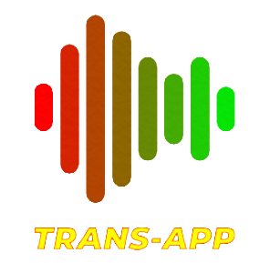
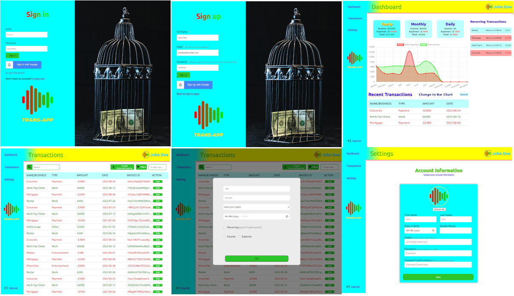
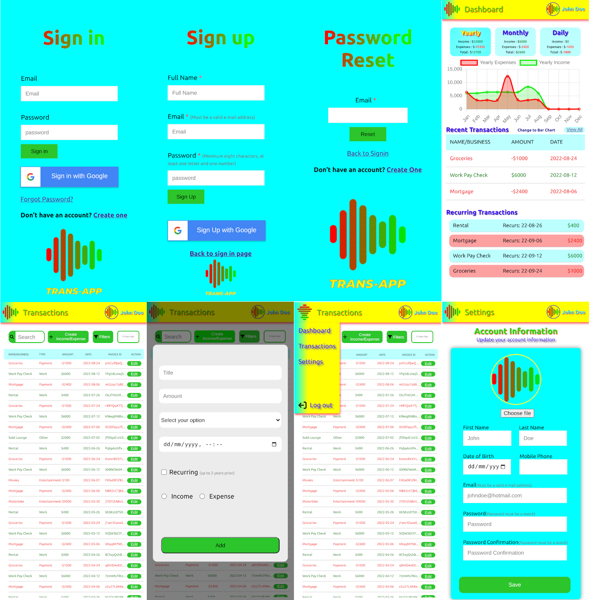

<!-- PROJECT LOGO -->
 

<!-- change this href to github pages when done -->
  

<h3 align="center">Trans-App</h3>

  

    Expense/Income Tracking App
     
    <a href="https://github.com/sirjamo1/React-Expense-Tracker"><strong>Explore the docs »</strong></a>
     
     
    <a href="https://github.com/sirjamo1/React-Expense-Tracker">View Demo</a>
    ·
    <a href="https://github.com/sirjamo1/React-Expense-Tracker/issues">Report Bug</a>
    ·
    <a href="https://github.com/sirjamo1/React-Expense-Tracker/issues">Request Feature</a>
  

<!-- TABLE OF CONTENTS -->

  
Table of Contents

  <ol>
    <li>
      <a href="#about-the-project">About The Project</a>
      <ul>
        <li><a href="#built-with">Built With</a></li>
      </ul>
    </li>
    <li>
      <a href="#getting-started">Getting Started</a>
    </li>
     <li>
      <a href="#need-to-do">Need To Do</a>
    </li>
    <li>
      <a href="#screenshots">Screenshots</a>
      <ul>
        <li><a href="#desktop">Desktop</a></li>
        <li><a href="#mobile">Mobile</a></li>
      </ul>
    <li><a href="#contact">Contact</a></li>
    <li><a href="#acknowledgments">Acknowledgments</a></li>
  </ol>

<!-- ABOUT THE PROJECT -->

## About The Project

<!-- [![Product Name Screen Shot][product-screenshot]](https://example.com) -->

Expense/income tracking app created for Betterway React bootcamp

(<a href="#readme-top">back to top</a>)

### Built With

-   [![React][react.js]][react-url]
-   FireStore

(<a href="#readme-top">back to top</a>)

<!-- GETTING STARTED -->

## Getting Started

Click the Trans-App logo to preview the app.   A John Doe account has been set up for you.  

 
Email : johnDoe@hotmail.com  
Password : password123

<!-- Features -->

## Features

-   Sign in or setup a new account
    -   Sign in with email and password
    -   Sign in with google
    -   Reset password with email

-   Dashboard
    -   Charts
        -   View in line or bar chart with one click
        -   Year
        -   Month
        -   Day
    -   Three most recent transactions
    -   Recurring Transactions
        -   Current recurring transactions (with next recurring date)
-   Transactions
    -   Create transaction
    -   Option for monthly recurring (up to 2 years prior)
    -   Edit transaction
    -   Delete transaction
    -   Search transactions
    -   Filter transactions
    -   Search "X" days ago
-   Settings
    -   Change first and last name (display name)
    -   Upload/Change a new display picture
    -   Change DOB and Mobile
        -   (not currently working, due to firebase not having that option. Can fix with linking it to user collection)
    -   Change user Sign in e-mail
    -   Change user Sign in password
-   Mobile Friendly
-   Animations when opening pages

See the [open issues](https://github.com/sirjamo1/React-Expense-Tracker/issues) for a full list of proposed features (and known issues).

(<a href="#readme-top">back to top</a>)

## Need To Do

-   Mobile
    -   Create/edit trans popup gets moved by mobile keyboard 
    -   
    -   Refresh (reloading page) redirectes user to signin page (this also happens on desktop)
    -   
    -   
    -   

## Screenshots
### Desktop

(<a href="#readme-top">back to top</a>)

### Mobile

(<a href="#readme-top">back to top</a>)

<!-- CONTACT -->

## Contact

Project Link: [https://github.com/sirjamo1/React-Expense-Tracker](https://github.com/sirjamo1/React-Expense-Tracker)

(<a href="#readme-top">back to top</a>)

<!-- ACKNOWLEDGMENTS -->

## Acknowledgments

-   Project was done in collaboration with kingmathers92 https://github.com/kingmathers92
-   Dollar in birdcage image from pexels.com by Reynaldo #brigworkz Brigantty

(<a href="#readme-top">back to top</a>)

<!-- MARKDOWN LINKS & IMAGES -->
<!-- https://www.markdownguide.org/basic-syntax/#reference-style-links -->

[contributors-shield]: https://img.shields.io/github/contributors/github_username/repo_name.svg?style=for-the-badge
[contributors-url]: https://github.com/github_username/repo_name/graphs/contributors
[forks-shield]: https://img.shields.io/github/forks/github_username/repo_name.svg?style=for-the-badge
[forks-url]: https://github.com/github_username/repo_name/network/members
[stars-shield]: https://img.shields.io/github/stars/github_username/repo_name.svg?style=for-the-badge
[stars-url]: https://github.com/github_username/repo_name/stargazers
[issues-shield]: https://img.shields.io/github/issues/github_username/repo_name.svg?style=for-the-badge
[issues-url]: https://github.com/github_username/repo_name/issues
[license-shield]: https://img.shields.io/github/license/github_username/repo_name.svg?style=for-the-badge

<!-- [license-url]: https://github.com/github_username/repo_name/blob/master/LICENSE.txt -->

[linkedin-shield]: https://img.shields.io/badge/-LinkedIn-black.svg?style=for-the-badge&logo=linkedin&colorB=555
[linkedin-url]: https://linkedin.com/in/linkedin_username
[product-screenshot]: images/screenshot.png
[next.js]: https://img.shields.io/badge/next.js-000000?style=for-the-badge&logo=nextdotjs&logoColor=white
[next-url]: https://nextjs.org/
[react.js]: https://img.shields.io/badge/React-20232A?style=for-the-badge&logo=react&logoColor=61DAFB
[react-url]: https://reactjs.org/
[vue.js]: https://img.shields.io/badge/Vue.js-35495E?style=for-the-badge&logo=vuedotjs&logoColor=4FC08D
[vue-url]: https://vuejs.org/
[angular.io]: https://img.shields.io/badge/Angular-DD0031?style=for-the-badge&logo=angular&logoColor=white
[angular-url]: https://angular.io/
[svelte.dev]: https://img.shields.io/badge/Svelte-4A4A55?style=for-the-badge&logo=svelte&logoColor=FF3E00
[svelte-url]: https://svelte.dev/
[laravel.com]: https://img.shields.io/badge/Laravel-FF2D20?style=for-the-badge&logo=laravel&logoColor=white
[laravel-url]: https://laravel.com
[bootstrap.com]: https://img.shields.io/badge/Bootstrap-563D7C?style=for-the-badge&logo=bootstrap&logoColor=white
[bootstrap-url]: https://getbootstrap.com
[jquery.com]: https://img.shields.io/badge/jQuery-0769AD?style=for-the-badge&logo=jquery&logoColor=white
[jquery-url]: https://jquery.com
